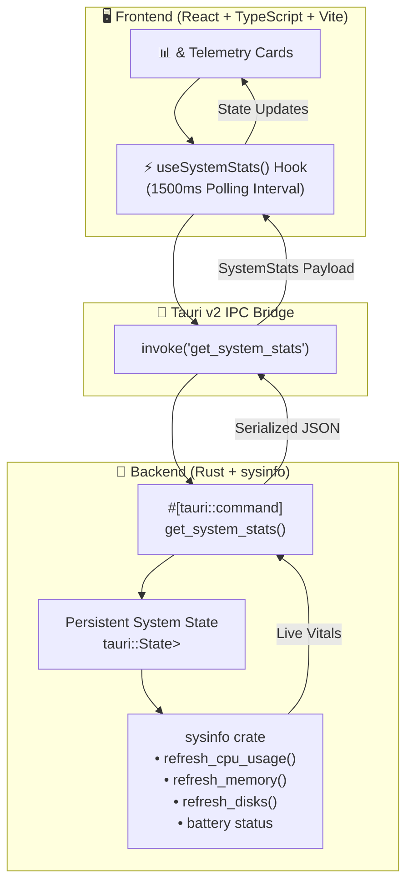

<div align="center">

# ⚡ FerroSense

### *Ultra-Lightweight, Bloat-Free Laptop Vitals & Hardware Monitor*

[](https://tauri.app/)
[](https://www.rust-lang.org/)
[](https://react.dev/)
[](https://www.typescriptlang.org/)
[](https://vitejs.dev/)
[](https://opensource.org/licenses/MIT)
[](#)

<p align="center">
  <b>A modern, open-source alternative to heavy OEM hardware utilities (NitroSense, Armoury Crate, Dragon Center).</b><br>
  Built with native Rust backend performance and an ultra-responsive React dashboard.
</p>

---

[✨ Overview](#-overview) •
[🎯 Project Scope](#-project-scope-poc-phase) •
[🏗️ Architecture](#️-architecture--data-flow) •
[🛠️ Tech Stack](#️-tech-stack) •
[🚀 Quick Start](#-quick-start) •
[📂 Repository Structure](#-repository-structure) •
[🔄 Git Workflow](#-git-workflow--standards) •
[🤖 CI/CD Pipeline](#-cicd-github-actions-workflow) •
[🗺️ Roadmap](#️-roadmap)

---

</div>

## ✨ Overview

**FerroSense** is an open-source, lightning-fast hardware telemetry dashboard designed for laptops and desktops. Unlike proprietary OEM management tools that consume hundreds of megabytes of RAM and run background telemetry services, **FerroSense** provides essential hardware vitals with near-zero resource consumption.

> 🔒 **Mode:** *Trust but Verify* — Discovery before execution, minimal diffs, zero hardcoded mock data.

---

## 🎯 Project Scope (POC Phase)

| Category | Telemetry / Feature | Status | Description |
| :--- | :--- | :---: | :--- |
| 🧠 **CPU** | **Overall Usage %** | 🟢 **In Scope** | Real-time global CPU load with delta calculation |
| 🧠 **CPU** | **Per-Core Breakdown** | 🟢 **In Scope** | Individual logical core utilization metrics |
| 💾 **Memory** | **RAM Usage (GB & %)** | 🟢 **In Scope** | Precise used vs. total physical memory metrics |
| 💽 **Storage** | **Primary Disk Usage %** | 🟢 **In Scope** | Primary volume (`C:\` / root) capacity & usage |
| 🔋 **Power** | **Battery % & Status** | 🟢 **In Scope** | Percentage & AC charging state (*graceful null on desktops*) |
| ⏱️ **Polling** | **1.5s Live Refresh** | 🟢 **In Scope** | Non-blocking periodic polling via Tauri IPC |
| 🎨 **UI** | **Dark Modern Dashboard** | 🟢 **In Scope** | High-contrast telemetry cards with live visual gauges |
| 🌡️ **Thermals** | **CPU/GPU Temperature** | 🟡 *Phase 1* | *Deferred: Requires LibreHardwareMonitor / Admin Privileges* |
| 🌀 **Cooling** | **Fan Speeds & Curves** | 🟡 *Phase 1* | *Deferred: Requires EC / OEM driver interface* |
| 📌 **System** | **Tray & Auto-Start** | ⚪ *Phase 2* | *Deferred: Background daemon & packaging* |

---

## 🏗️ Architecture & Data Flow



---

## 🛠️ Tech Stack

| Layer | Technology | Version | Purpose |
| :--- | :--- | :--- | :--- |
| **Desktop Shell** | [Tauri](https://tauri.app/) | `^2.0` | Ultra-lightweight native window manager & IPC bridge |
| **Backend Core** | [Rust](https://www.rust-lang.org/) | `2021 Edition` | Memory-safe, high-speed OS telemetry collection |
| **System Probing**| [`sysinfo`](https://crates.io/crates/sysinfo) | `^0.33` | Cross-platform hardware metrics (CPU, RAM, Disk, Power) |
| **Frontend Framework** | [React](https://react.dev/) | `^18.3 / ^19.0` | Component-driven declarative UI |
| **Language** | [TypeScript](https://www.typescriptlang.org/) | `^5.0` | Type-safe models for IPC communication |
| **Build Tool** | [Vite](https://vitejs.dev/) | `^6.0` | Sub-millisecond HMR & optimized production bundles |
| **Styling** | Vanilla Modern CSS | — | Sleek dark-mode aesthetic with hardware gauge micro-animations |

---

## 🚀 Quick Start

### 📋 Prerequisites
* **Node.js**: `v20+` or `v24+` installed ([Download](https://nodejs.org/))
* **Rust**: `stable` toolchain (`rustc`, `cargo`) installed via [rustup.rs](https://rustup.rs/)
* **C++ Build Tools**: Microsoft C++ Build Tools (Windows)

### 💻 Installation & Local Development

1. **Clone the repository:**
   ```bash
   git clone https://github.com/your-username/ferrosense.git
   cd ferrosense
   ```

2. **Install frontend dependencies:**
   ```bash
   npm install
   ```

3. **Launch in development mode:**
   ```bash
   npm run tauri dev
   ```

4. **Build production standalone executable:**
   ```bash
   npm run tauri build
   ```

---

## 📂 Repository Structure

```
ferrosense/
├── 📁 .github/
│   ├── 📁 ISSUE_TEMPLATE/
│   │   ├── 📝 bug_report.md
│   │   └── 📝 feature_request.md
│   ├── 📝 PULL_REQUEST_TEMPLATE.md
│   └── 📁 workflows/
│       ├── 🤖 ci.yml                 # Build & lint check on PR/push
│       └── 🚀 release.yml            # Multi-platform binary release
├── 📁 src/                           # ⚛️ React Frontend
│   ├── 📁 assets/                    # Icons & visual assets
│   ├── 📁 components/
│   │   ├── 📊 Dashboard.tsx          # Main metrics grid
│   │   ├── 🎛️ StatCard.tsx           # Reusable metric card with progress bar
│   │   └── ℹ️ Phase1Notice.tsx       # Thermal & fan telemetry notice
│   ├── 📁 hooks/
│   │   └── ⚡ useSystemStats.ts       # 1500ms polling hook
│   ├── 📁 types/
│   │   └── 📋 stats.ts               # IPC interface type definitions
│   ├── 📄 App.tsx
│   ├── 🎨 App.css
│   ├── 🎨 index.css
│   └── 📄 main.tsx
├── 📁 src-tauri/                     # 🦀 Rust Backend (Tauri)
│   ├── 📁 src/
│   │   ├── 🦀 lib.rs
│   │   ├── 🦀 main.rs
│   │   └── 🦀 stats.rs               # sysinfo probe handlers
│   ├── 📦 Cargo.toml
│   ├── ⚙️ tauri.conf.json
│   └── 📁 capabilities/
│       └── 🛡️ default.json
├── 📄 .gitignore
├── 📄 package.json
├── 📄 tsconfig.json
├── 📄 vite.config.ts
├── 📄 LICENSE
└── 📄 README.md
```

---

## 🔄 Git Workflow & Standards

### 🌿 Branching Strategy
* `main` — Always stable, deployable code.
* `develop` / `feat/*` — Feature development branches.
* `fix/*` — Bug fixes and hotfixes.

### 📝 Commit Message Conventions (Conventional Commits)
```
feat(backend): add sysinfo cpu and ram telemetry command
feat(ui): implement StatCard with animated circular gauge
fix(battery): handle desktop devices without battery gracefully
docs: update setup instructions and architecture diagram in README
ci: add GitHub Actions workflow for Tauri v2 build
```

---

## 🤖 CI/CD GitHub Actions Workflow

Located at `.github/workflows/ci.yml`:

```yaml
name: 🚀 CI Pipeline

on:
  push:
    branches: [ main ]
  pull_request:
    branches: [ main ]

jobs:
  validate:
    name: 🧪 Build & Validate (Windows)
    runs-on: windows-latest
    steps:
      - name: 📥 Checkout Repository
        uses: actions/checkout@v4

      - name: 🟢 Setup Node.js
        uses: actions/setup-node@v4
        with:
          node-version: 22
          cache: 'npm'

      - name: 🦀 Install Rust Stable
        uses: dtolnay/rust-toolchain@stable

      - name: ⚡ Cache Rust Dependencies
        uses: swatinem/rust-cache@v2
        with:
          workspaces: './src-tauri -> target'

      - name: 📦 Install Frontend Dependencies
        run: npm ci

      - name: 🔍 Typecheck & Build Frontend
        run: npm run build

      - name: 🦀 Cargo Check & Validate Backend
        run: cargo check --manifest-path src-tauri/Cargo.toml
```

---

## 🗺️ Roadmap

- [x] **Phase 0: Architecture & Discovery**
  - [x] Tech stack finalization (Tauri v2 + Rust + React + Vite).
  - [x] System capability analysis (`sysinfo` API & delta sampling).
- [ ] **Phase POC: Core Vitals Dashboard**
  - [ ] Scaffold Tauri v2 + React TypeScript workspace.
  - [ ] Rust `get_system_stats()` command (CPU, RAM, Disk, Battery).
  - [ ] React `useSystemStats` hook with 1500ms auto-refresh.
  - [ ] High-contrast hardware dashboard UI.
  - [ ] Real-time verification against Windows Task Manager.
- [ ] **Phase 1: Deep Hardware Telemetry**
  - [ ] Bundle `LibreHardwareMonitor` sidecar executable.
  - [ ] CPU / GPU temperature sensors with thermal throttling indicators.
  - [ ] Fan RPM readings & custom fan profiles.
- [ ] **Phase 2: System Integration & Polish**
  - [ ] System tray icon with quick peek popover.
  - [ ] Start on system boot toggle.
  - [ ] Compact overlay mode for in-game monitoring.

---

## 🤝 Contributing & Issue Reporting

Contributions, issues, and feature requests are welcome!

1. Check existing [Issues](https://github.com/your-username/ferrosense/issues).
2. For bugs: Include your OS build, laptop model, and reproduction steps.
3. For PRs: Ensure `npm run build` and `cargo check` pass cleanly before submitting.

---

## 📄 License

This project is licensed under the [MIT License](LICENSE).

<div align="center">
  <sub>Built with 🦀 Rust, ⚡ Tauri, and ⚛️ React. Made for hardware enthusiasts.</sub>
</div>